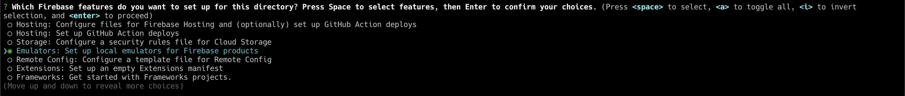
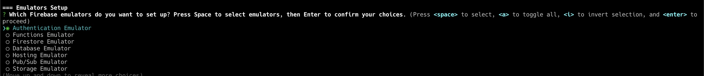

# Init firebase

You need to install Firebase CLI[https://firebase.google.com/docs/cli#install_the_firebase_cli] to use Firebase Emulators.
After installing Firebase CLI, you need to login to your Google account.

```bash
firebase login
```

Then, you need to initialize Firebase project in your project directory.

```bash
firebase init
```

You need to select Firebase Emulators in the list and hit enter.


Then, you need to select the firebase project you want to use in the list and hit enter.

Now you need to select which emulators you want to use. You need to select Authentication emulator and hit enter.


## Environment variables

Create a file named `.env` in the root directory of the project. Then, add the variables below to the file or copy the content of `.env.example` file to `.env` file.

```bash
VITE_FIREBASE_API_KEY=API_KEY_HERE
VITE_FIREBASE_APP_ID=APP_ID_HERE
VITE_FIREBASE_USE_EMULATOR=true # true in development, false in production
VITE_FIREBASE_AUTH_DOMAIN=AUTH_DOMAIN_HERE
```

## Run the Emulator

````bash
npm run firebase
```

or

```bash
firebase emulators:start
````

# Run the project

```bash
npm run dev
```

or

```bash
yarn dev
```

# Build the project

```bash
npm run build
```

or

```bash
yarn build
```
